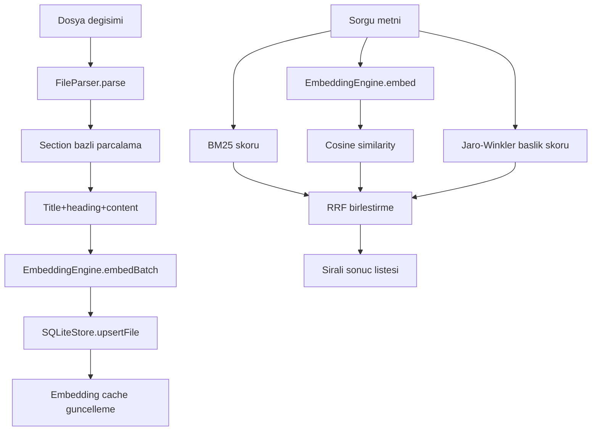

# VaultSearch algoritmalar ve matematik (TR)

### 1) Uçtan uca çalışma prensibi

VaultSearch iki ana akış (pipeline) üzerinden çalışır:

- İndeksleme tarafında akış: parse -> chunk -> embedding -> store upsert.
- Arama tarafında BM25, vektör benzerliği ve başlık benzerliği sinyalleri üretilir; sonuçlar RRF ile birleştirilir.

### 2) Teknik terimler

- **Embedding**: Metnin sayısal vektör temsili. Anlamsal olarak yakın metinler, vektör uzayında birbirine yakın konumlanır.
- **Token**: Modelin metni işlerken kullandığı temel birim. Bu projede tam tokenizer yerine yaklaşık token hesabı kullanılır.
- **TF (Term Frequency)**: Bir terimin ilgili chunk içinde kaç kez geçtiği.
- **DF (Document Frequency)**: Bir terimin toplam kaç chunk/dokümanda görüldüğü.
- **IDF (Inverse Document Frequency)**: Sık geçen terimlerin etkisini azaltan, nadir terimlerin etkisini artıran katsayı.
- **BM25**: TF, IDF ve doküman uzunluğu normalizasyonunu birleştirerek anahtar kelime alaka skoru üreten yöntem.
- **Cosine similarity**: İki vektör arasındaki açısal benzerlik. Değer büyüdükçe semantik yakınlık artar.
- **Jaro-Winkler**: Özellikle kısa metinlerde ve yazım hatalarında güçlü sonuç veren fuzzy benzerlik metriği.
- **RRF (Reciprocal Rank Fusion)**: Farklı sıralama listelerini ham skorlara doğrudan bağlı kalmadan rank seviyesinde birleştiren yöntem.

### 3) Chunking ve yaklaşık token modeli

- Metin, heading satırlarına göre section’lara ayrılır.
- Her section, yapılandırılmış boyutta chunk’lara bölünür; chunk’lar arasında overlap uygulanır.
- Kullanılan yaklaşık hesap:
  - `estimatedWordsPerChunk = floor(chunkMaxTokens * 3.5)`
  - `overlapWords = floor(chunkOverlapTokens * 3.5)`
  - `tokenCount ~= ceil(text.length / 3.5)`

Neden bu yaklaşım:
- Hızlı ve deterministik.
- Runtime tarafında ek tokenizer bağımlılığına ihtiyaç duymaz.

### 4) Embedding pipeline

- Embedding işlemi ana thread dışında, worker içinde çalışır.
- Model pipeline ayarları:
  - `feature-extraction`
  - `pooling: mean`
  - `normalize: true`
- Embedding girdisi:
  - `title + "\n" + heading + "\n" + chunkContent`

Neden bu yaklaşım:
- Obsidian arayüzü bloklanmaz.
- Kısa chunk’larda belge bağlamı (başlık/heading) korunur.
- Normalize embedding sayesinde cosine hesapları daha stabil olur.

### 5) BM25, IDF, cosine, Jaro-Winkler, RRF detayları

- **IDF formülü**:
  - `IDF(t) = ln((N - df + 0.5)/(df + 0.5) + 1)`
- **BM25 çekirdeği**:
  - `score += (idf * tf * (k1 + 1)) / (tf + k1 * (1 - b + b * dl/avgdl))`
  - default: `k1=1.5`, `b=0.75`
- **Cosine**:
  - `cos(theta) = dot(q, d) / (||q|| * ||d||)`
- **Title fuzzy sinyali**:
  - Jaro-Winkler skoru ile başlık benzerliği ölçülür.
- **RRF katkısı**:
  - `contribution = weight / (k + rank)`
  - default `k=60`

Neden RRF:
- Farklı sinyallerin ham skor aralıkları farklı olduğundan, rank düzeyinde birleştirme daha güvenilir olur.

### 6) Fallback ve limitler

- Worker veya model başlatılamazsa hash tabanlı fallback embedding devreye girer.
- Bu fallback deterministiktir; ancak semantik kalite belirgin şekilde düşer.
- Vektör arama brute-force olduğu için karmaşıklık `O(chunkSayisi)` düzeyindedir.
- BM25 tokenization tarafı sade tutulduğu için stemming/lemmatization gibi dil bağımlı NLP adımları uygulanmaz.

### 7) Terminoloji standardı

- **Embedding** (Embeding değil)
- **Approximate token / yaklaşık token**
- **Raw score** vs **weighted score**
- **RRF score** final sıralama değeri

### 8) Kaynak kod referansları

- `src/core/VaultIndexer.ts`
- `src/core/FileParser.ts`
- `src/utils/tokenCounter.ts`
- `src/core/EmbeddingEngine.ts`
- `src/workers/embeddingWorker.ts`
- `src/core/SQLiteStore/scoring.ts`
- `src/core/SQLiteStore/searchOps.ts`
- `src/utils/jaroWinkler.ts`
- `src/core/SearchEngine.ts`
