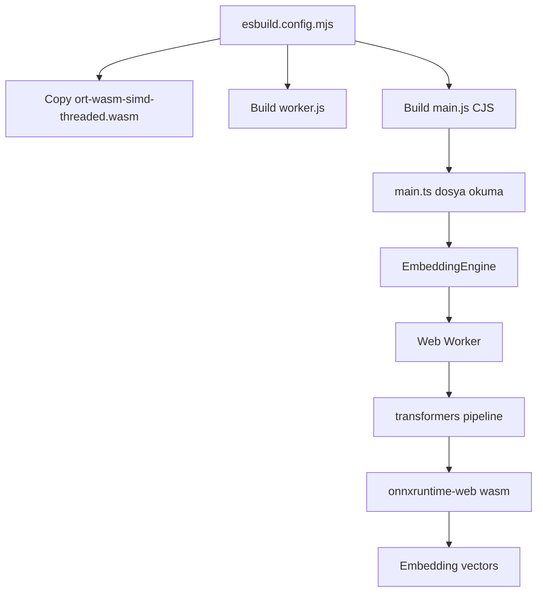

# VaultSearch ucuncu parti bilesenler ve modeller (TR)

### 1) Bağımlılık haritası

#### Runtime
- `@huggingface/transformers`: Semantik arama için embedding üretim pipeline’ı.
- `sql.js`: Native bağımlılık gerektirmeden WASM üzerinde çalışan SQLite katmanı.

#### Tooling
- `esbuild`: `main.js` ve `worker.js` çıktılarının derlenmesi.
- `typescript`, `@types/*`: Tip güvenliği ve derleme zamanı doğrulama.
- `eslint`, `eslint-plugin-obsidianmd`: Kod kalitesi ve Obsidian UI metin kuralları.
- `bun`: Paket yönetimi ve script çalıştırma.

### 2) Teknik terimler

- **WASM (WebAssembly)**: JavaScript çalışma ortamında yüksek verimle çalışan taşınabilir ikili format.
- **ONNX Runtime Web**: ONNX modellerini tarayıcı/worker ortamında (WASM tabanlı) çalıştıran çalışma zamanı.
- **Artifact**: Build sonunda oluşan ve runtime’da gerekli olan dosya (`main.js`, `worker.js`, `ort-wasm-*.wasm` gibi).
- **Alias (bundler alias)**: Bir import yolunu build aşamasında başka bir pakete/dosyaya yönlendirme mekanizması.
- **Stub**: Runtime’da kullanılmayacak bir bağımlılığı güvenli bir “boş” karşılıkla ikame etme tekniği.
- **CJS (CommonJS)**: Obsidian plugin yükleyicisi ile uyumlu modül formatı.

### 3) Neden WASM tabanlı bir stack?

VaultSearch, Obsidian/Electron eklenti kısıtlarına uyum sağlamak için native modüllerden kaçınır:
- Veritabanı tarafında `sql.js` (WASM).
- Model çalıştırma tarafında `onnxruntime-web` (WASM).
- `sharp` gibi native transitif bağımlılıklar build-time stub ile etkisizleştirilir.

Neden:
- Platformlar arası dağıtım daha öngörülebilir olur.
- Runtime’da native addon gereksinimi azaltılır.

### 4) Transformers + ORT-WASM entegrasyonu

Build tarafında:
- ORT WASM binary dosyası plugin köküne kopyalanır.
- Worker ve main ayrı hedefler için bundle edilir.
- Alias/stub kuralları ile native yollara sapma engellenir.

Runtime tarafında:
- `main.ts`, worker source dosyasını ve ORT WASM binary’sini okur.
- `EmbeddingEngine`, worker’ı Blob URL ile başlatır.
- Worker, pipeline’ı `device: 'wasm'` ve `dtype: 'fp32'` ile yükler.
- Embedding çıktıları `Float32Array` olarak ana threade geri aktarılır.

### 5) `sql.js` kullanımı

- `sql.js/dist/sql-wasm.wasm` build aşamasında import edilir.
- Runtime başlatma `initSqlJs` ile yapılır.
- Şemadaki ana tablolar: `meta`, `files`, `chunks`.

Önemli not:
- BM25 hesapları mevcut implementasyonda TypeScript tarafında yapılır; SQL FTS üzerinden hesaplanmaz.

### 6) Model seçimi

Default model:
- `sentence-transformers/paraphrase-multilingual-MiniLM-L12-v2`
- 384 boyutlu embedding uzayı

Neden:
- Çok dilli arama kalitesi sağlar.
- Boyut ve performans arasında dengeli bir tercih sunar.

### 7) Riskli/yanlış anlaşılmaya açık noktalar

- `worker.js` ve `ort-wasm-simd-threaded.wasm`, runtime için zorunlu artifact’lerdir.
- Alias/stub blokları “gereksiz temizlik” gerekçesiyle kaldırılmamalıdır.
- Fallback embedding sistemi ayakta tutar; ancak semantik kaliteyi düşürür.

### 8) Kaynak referansları

- `package.json`
- `esbuild.config.mjs`
- `src/main.ts`
- `src/core/EmbeddingEngine.ts`
- `src/workers/embeddingWorker.ts`
- `src/sqlJsRuntime.ts`
- `src/sqlJsBundled.ts`
- `src/core/SQLiteStore/schema.ts`
